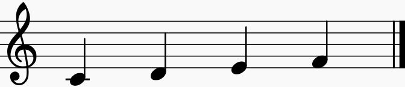

# Simple Music Notation Processor

## What is it?
SMNP is a command line tool aimed on doing music stuff using custom domain-specific language.
You are able to create music (both monophonic and polyphonic) using simple notation 
and then synthesize it with custom settings, plot the signal, evaluate DFT on it and so on.
Music tools can be used not only to create music but also to prepare kind of scenarios 
of ear trainings like recognizing intervals etc.
Apart of that developed domain-specific language offers you tools known from most popular 
programming languages like conditional statements, loops, variable mechanism, 
functions (including defining custom ones) etc.
  

## For what?
You might ask whether such kind of tool including design of custom language isn't 
over-engineering of ear-training problem. There are a lot of ear-training tools developed even
on mobile platforms which can make them more convenient to use because of their portability feature.  

The reasons for this tool are:
* I'm Java developer and I just wanted to get know more Python, which I used to use at the college.
And well, I'm starting from the assumption, that te best thing that you can do to learn new programming 
language is... creating a new one with it. ;-)
Besides, I'm kind of interested in technical side of programming languages that I'm using at work, 
so designing and implementing a custom language from scratch would be a nice experience. 
* I'm musician also and no one of available tools is suitable for me. 
I'm church organist and most of my work is based on dialogue between me and priest. He can
sing melodies in different keys and it requires me to answer keeping the same key. 
My tool allows me to create scenarios that can pick one key randomly and play melody 
waiting for my answer (basing on input from microphone).
* As a musician I'm also keen on physic nature of sounds and relations between them. 
All audio stuff (except hardware layer) implemented to this tool is created from scratch.
It means that the tool synthesises sound by itself and makes use of 3rd party library
only to send compiled wave to speakers. 

## Disclaimers
1. Readability of the code and its structure is one of most important things
related to educational aspect of the project. And in spite of having huge negative impact 
on efficiency of the tool, according to one of the assumptions 
it has much higher priority. So don't be surprised 
if the tool turns out to be extremely slow or ineffective.
2. I try writing consistent code and sticking with some convention of programming of course, 
however, as a Java developer I like Java guidelines and I really don't
like PEP8 (especially snakecased identifiers).
Just don't be surprised if you see Java-like code - it has been intentionally written.

## SMNP language
As mentioned before, SMNP introduces new language. All language evaluation engine (tokenizer, parser and evaluator)
is implemented without any 3rd party libraries and frameworks, just using vanilla Python. 

### About language
SMNP language is interpreted, high-level, formal language with syntax
mostly inspired by Java language and - according to Chomsky's hierarchy - *context-free* grammar.

#### Type system
SMNP is dynamic language, because there is no any static analyser between
parsing and evaluating stages. It means that any type-mismatching
will be raised on runtime, when control flow reacheas the point of error.

For example:
```
function foo(integer n) {
    println(n);
}

x = false;

if (x) {
    foo("hello");
}
```
As long as `x == false`, the code will be executed without any errors,
even though `foo` function expects `integer` argument and is being called
with `string`.
However if you switch `x` value to `true`, error will be raised when
control flow reaches `foo` function invocation with wrong argument's type.

Even though there is no real definition of *strongly-typed language*, 
we can say SMNP is strongly-typed, because there are no any implicit type
conversions. You always have to provide correct type, even for
string concatenation which accepts only `string` values:
```
# Incorrect
"My number is: " + 14;

# Correct
"My number is: " + 14.toString();
```

### Comments
SMNP language allows you to make comments in the code. 
It can be done with `#` character, like:
```
# This is is a comment
```
There is no syntax for multiline comment, but you can of course do something like this:
```
# This is
# a multiline
# comment
``` 
Note that because of hash-beginning comments you can 
put a *shebang* at the very first of your code making it more
convenient to execute:
```
#!/usr/bin/smnp
println("Hello, world!");

# And now add executable flag (chmod +x) 
# to the file and execute it like any other 
# script/program from the shell 
```

### Delimiter
SMNP language doesn't require you to delimit instructions, however it is still possible 
and highly recommended, because it helps you to get rid of code ambiguity.

Example:
```
size = [1, 2, 3].size
(size - 1) as i ^ print(i)
``` 
Execution of this code is interrupted with error, because SMNP parser
tries to interpret `size` property as method `size(size - 1)`.
As long as lists don't have `size` method (but they have `size` property),
error will be raised and you will be able to fix problem. However ambiguity could be
a less obvious and you can stick with debugging code having no idea what is going wrong.

To remove ambiguity you can end each instruction with semicolon `;`:
```
size = [1, 2, 3].size;
(size - 1) as i ^ print(i);  # 01
```

All code snippets of present document follows the convention of ending each 
instruction with semicolon.

### Basic types
SMNP language introduces 9 data types and *void* which is a *quasi-type* because of it special meaning.
Most of the types is known from other popular programming languages, like Java etc.

#### integer
`integer` is numeric data type and is suitable to signed integers, like -6, 0, 1, 14, 23164 etc.

Example:
```
a = 1;
b = -15;

sum = a + b;    # Produces also an integer
println(sum);   # -14
```

###### Methods:
* `toString()` [string] - returns a string representation of integer: `14.toString() == "14"`

###### Unary operators:
* `-` - negates value

###### Binary operators:
* `+` - sum
* `-` - difference
* `*` - product
* `/` - quotient
* `**` - power
* `==` - equals
* `!=` - not equals
* `>` - greater than
* `>=` - greater or equals
* `<` - less than
* `<=` - less or equal

#### float
`float` is numeric data type suitable for non-integer values, like: -3.4, 0.01, 3.14, 12.0043 etc.

Example:
```
pi = 3.14;
r = 12.5;

area = pi*r**2;
println(area);   # 490.625
```

###### Methods:
* `toString()` [string] - returns a string representation of float: `1.4.toString() == "1.4"`

###### Unary operators:
see `integer`

###### Binary operators:
see `integer`

#### string
`string` type is suitable to any sort of texts enabling you 
to create string of any characters, including Unicode.
For now, strings can be delimited only with double quote (`"`).

Example:
```
text = "Hello, world!";

println(text);   # Hello, world!
println(-text);  # !dlrow ,olleH
``` 

###### Properties
* `length` [integer] - length of string: `"hello".length == 5`

###### Methods
* `join(list<string> l)` [string] - join all elements of list `l` with 
given string as delimiter: `":".join(["1", "2", "3", "4"]) == "1:2:3:4"`
* `toString()` [string] - returns itself ;-)

###### Unary operators
* `-` - reverse string: `-"Hey!" == "!yeH"` (why not? ;-))

###### Binary operators
* `+` - concatenate strings: `"he" + "llo" == "hello"` 
* `==` - equals
* `!=` - not equals

#### bool
`bool` data type allows you to perform basic Boolean logic 
operations introducing two constant values: `true` and `false`.

Example:
```
_2b = false;

println(_2b or not _2b); # true
```

###### Methods:
* `toString()` [string] - returns a string representation of bool: `true.toString() == "true"`

###### Unary operators
* `not` - negate value: `not false == true`

###### Binary operators
* `and` - logical conjunction: `true and false == false`
* `or` - logical alternative: `true or false == true`
* `==` - equals
* `!=` - not equals

#### note
`note` is basic data type allowing you to compose music sheets.
It is a base music unit that represents a sound, i.e. its pitch and duration.

Note literal is written with the following syntax:
```
'@' PITCH [OCTAVE] [:DURATION [d]]

; where

PITCH := (c|d|e|f|g|a) [b|#] | h# | b
       | (C|D|E|F|G|A) [b|#] | H# | B
OCTAVE := 1-9
DURATION := /non-negative integer/
```
Duration number means the denominator (`n`) of fraction `1/n`, i.e.:
* `1` stands for whole note
* `2` stands for half note
* `4` stands for quarter note
* `8` stands for eighth note
* `16` stands for sixteenth note
* and so on

You can also put a `d` character after duration number to add a ***d**ot* to note, like:
* `2d` stands for half note and quarter note (dotted half note)
* `4d` stands for quarter note and eighth note (dotted quarter note)
* `16d` stands for sixteenth note and thirty-second note (dotted sixteenth note)
* and so on 

Default octave is `4` (1 Line) and default duration is `4` (quarter note).
Examples (note that pitch is case-insensitive):
* `@c` is quarter note with pitch *c'* 
* `@F5:2` is half note with pitch *f''*
* `@g#3:4d` is dotted quarter note with pitch *g♯*
* `@Ab6:16` is sixteenth note with pitch *a♭'''*
* `@b2:1` is whole note with pitch *B* (*H♭*)
* `@C#1:32d` is dotted thirty-second note with pitch *C♯,*

**Note:** note literal syntax cannot include any whitespace character. 

###### Properties
* `pitch` [string] - pitch of note: `@d#5:2d.pitch == "DIS"`
* `octave` [integer] - octave of note: `@d#5:2d.octave == 5`
* `duration` [integer] - duration of note: `@d#5:2d.duration == 2`
* `dot` [bool] - does note is dotted: `@d#5:2d.dot == true`

###### Methods
* `withOctave(integer octave)` [note] - factory method that copies 
note with new `octave` value: `@c.withOctave(5) == @c5`
* `withDuration(integer duration)` [note] - factory method that copies 
note with new `duration` value: `@c.withDuration(2) == @c:2`
* `withDot(bool dot)` [note] - factory method that copies 
note with new `dot` value: `@c.withDot(true) == @c:4d`
* `toIntRepr()` [integer] - convert note's pitch and octave to unique integer value
* `transpose(integer semitones)` [note] - copy note and transpose 
it with given number of semitones: `@c.transpose(2) == @d`
* `toString()` [string] - returns a string representation of note: `@g#.toString() == "G#"`

###### Binary operators
* `==` - equals
* `!=` - not equals

#### sound
`sound` is a wrapper for external music file, like `ogg`, `mp3` etc.
This is the only type that isn't possible to create syntactically. 
Instead of that it can be instantiated with constructor-like function, 
as at the example below:
```
myMusic = Sound("Music/Piano/Chopin/NocturneOp9No2.ogg");
myMusic.play();
``` 

###### Properties
* `file` [string] - a sound source file
* `fs` [integer] - sampling rate

###### Methods
* `play()` [void] - play a loaded sound file
* `toString()` [string] - returns a string representation of sound: `Sound("/../../music.ogg").toString == "/../../music.ogg"`

###### Binary operators
* `==` - equals
* `!=` - not equals

#### list
`list` is an ordered container able to store objects with different types.
List is created within square brackets (`[` and `]`) with items separated by comma (`,`).
Lists can be nested, which means they can contain another 
lists that can contain yet another lists and so on.

Example:
```
myList = [1, "hello", @Ab:2d, true, 14.0, [ "even", "other", list!"], [], {}];
println(myList.size);            # 9
println([14].size);              # 1
println([].size);                # 0
println(myList.contains(1));     # true
println(myList.contains(2));     # false
```

###### Properties
* `size` [integer] - a number of elements in list

###### Methods
* `get(integer index`) [?] - returns item of list with given index (**note:** indices start from **0**)
* `contains(element)` [bool] - test if list does contain given element
* `toString()` [string] - returns a string representation of list: `[1, 2].toString() == "[1, 2]`

###### Unary operators
* `-` - reverse lists (just because!): `-[1, 2, 3, 4] == [4, 3, 2, 1]`

###### Binary operators
* `+` - join lists: `[1, 2] + [3, 4] == [1, 2, 3, 4]`
* `==` - equals
* `!=` - not equals


#### map
`map` is unordered container able to store pairs `key-value` with different 
types of both key and value.
Syntactically map is a set of pairs `key-value` separated with comma (`,`) and placed
between braces (`{` and `}`). Single `key-value` pair is created from two items 
separated with arrow operator `->`. Similarly to lists, maps can also be nested.
Keys of course must be unique for single map object.

Even though value of pair can be arbitrary expression, key 
should be explicit literal, like integer, note, bool value, type and string. 
Lists and other maps can't be used as keys. Note that if string 
key doesn't have any whitespaces, there is no need to use quotes around it.

Example:
```
myMap = {
    1 -> "hello",
    @c -> "world",
    true -> false,
    "hey" -> 14,
    hey2 -> "key without quotes!",
    empty -> {},
    theList -> [1, 2, [], { inside -> ":-)" }]
};

println(myMap.size);         # 4
println(myMap.get(@c));      # world
println(myMap.get("hey"));   # 14
println(myMap.get("hey2"));  # key without quotes!
```

###### Properties
* `size` [integer] - number of map entries (pairs)
* `keys` [list] - list of keys: `{ a -> 1, b -> 2 }.keys == ["a", "b"]`
* `values` [list] - list of values: `{ a -> 1, b -> 2}.values == [1, 2]`

###### Methods
* `containsKey(key)` [bool] - test if map does contain pair with given key
* `containsValue(value)` [bool] - test if map does contain pair with given value
* `contains(key, value)` [bool] - test if map does contain pair with given key **and** given value
* `toString()` [string] - returns a string representation of map: `{ a -> 1, b -> 2}.toString() == "{'a' -> '1', 'b' -> '2'}"`

###### Binary operators
* `+` - join maps: `{ a -> 1 } + { b -> 2 } == { a -> 1, b -> 2 }`
* `==` - equals
* `!=` - not equals

#### type
`type` represents all available data types including itself.
It is mostly used to get meta information about other values in code.

Example:
```
myNumber = 14;
println(typeOf(myNumber) == integer);        # true
println(typeOf(myNumber) == bool);           # false
println(typeOf(myNumber) == note);           # false
println(typeOf(typeOf(myNumber)) == type);   # true
println(typeOf(type));                       # type
```

###### Methods
* `toString()` [string] - returns a string representation of type: `integer.toString() == "integer"`

###### Binary operators
* `==` - equals
* `!=` - not equals

#### void
`void` is special data type introduced to distinguish functions returning a value from 
functions that don't return anything. It can't be used in any way and the only possibility
to do something with that is getting the type of it or getting a string representation of it.

Example:
```
void;                        # It actually does nothing
println(void.toString());    # void
println(typeOf(void));       # type
```  

### Variables
SMNP language's variable mechanism allows you to store some data in memory which could be
used in the later stages of code. Even though SMNP language has a data types, declaring 
new variables doesn't require you to explicitly put a type before declaration as in the case 
of most popular languages, like Java etc. Hence it is not possible to declare variable
without initialization. You always have to initialize your variable when you are declaring it.
Initialization can be done with assignment operator (`=`). The right hand side should be
expression (value, function call or even other variable) but the left hand side can be only
variable identifier.

```
myVar;        # It is not a declaration
myVar = 2;    # It is a declaration. From now you are able to use variable myVar
3 = 2;        # error! 
var2 = foo(); # Correct
var2 = myVar; # Also correct
```

Variables are nothing but references to objects (values) and their don't have any type.
In other words you are able to assign value of different type to already initialized variable.

```
myVar = 2;
println(myVar);              # 2
myVar = "Hello, world!";
println(myVar);              # Hello, world!
```

Because assignment is an expression which returns a value being assigned it is possible
to perform multiple initialization.

```
a = b = c = 10;             # It is like a = (b = (c = 10))
println(a == b and b == c); # true
```

SMNP language doesn't have any equivalent of Python's `del` instructions, so you aren't 
able to delete already created variable. The only way is using scopes.

#### Scopes
Scopes are strongly related to blocks.
Block is a set of statements and expressions bounded on both sides with `{` and respectively `}`.
Even though it is not required and you can write whole code in one line, it is highly recommend
to use any kind of indentations for each block, including blocks nested inside.
```
println("I'm outside any block");

{
   println("I'm in the first-level block");
   {
      println("I'm in second-level block");
   }

   println("Greetings from first-level block again");
}
    
```

In context of variable mechanism it is important to know that variables declared inside 
block are available to each instructions following declaration **in the same block** 
and for each nested block placed after variable declaration.

```
var1 = "top-level";
{
    var2 = "first-level";
    println(var1);               # "top-level"
    println(var3);               # error!
    {
        var3 = "second-level";
        println(var1);           # "top-level"
        println(var2);           # "first-level"
        println(var3);           # "second-level"
    }
    println(var2);               # "first-level"
    println(var3);               # error!
}

println(var2);                   # error!
println(var1);                   # "top-level"
```

#### Identifiers
It is also important to know what is identifier in context of SMNP language.
Identifier is a string that contains only letters (both lowercase and uppercase), numbers and `_` character.
Identifier must not start with number and must not be any of reserved words (keywords).

List of keywords:
* `and`
* `or`
* `not`
* `integer`
* `string`
* `float`
* `note`
* `bool`
* `type`
* `list`
* `map`
* `function`
* `return`
* `extend`
* `import`
* `throw`
* `from`
* `with`
* `if`
* `else`
* `as`


```
# Valid identifiers
i
var
myVar
my_var
var20
x_YZ
_vArIaBlE
_if
_return
returns

# Invalid identifiers
19i
foo[
bar@
return
!@#%$
if
as
```

#### Immutability
It's a good place to say that all values in SMNP code are **immutable**.
That means you are not able to e.g. change pitch of existing note, change arbitrary letter
of string, put object to list and so on.

You are able to produce note basing on given one with new pitch or join two or more lists 
but these operations produces new objects and leave values unmodified.

```
a = [1, 2];
b = [3, 4];
c = a + b;
println(a == [1, 2]);        # true
println(b == [3, 4]);        # true
println(c == [1, 2, 3, 4]);  # true

a = @c;
b = a.withDuration(2);
println(a == @c);            # true
println(b == @c:2);          # true
```

### Operators precedence
SMNLP language's operators have their unique priorities which determine operations' order
in case of ambiguity. 

| Operator(s)     | Precedence |
|----------------:|:----------:|
| `-` (unary)     |     1      |
| `.`             |     2      |
| `**`            |     3      |
| `not`           |     4      |
| `*` `/`         |     5      |
| `+` `-` (binary)|     6      |
| `==` `!=`       |            |
| `<=` `>=`       |     7      |
| `<` `>`         |            |
| `and`           |     8      |
| `or`            |     9      |
| `^`             |    10      | 

Remember, that in spite of operators precedence you can always force priority using parentheses:
```
a = -2+2;
b = -(2+2);

println(a);  # 0
println(b);  # -4
```  

### Methods and functions
Function is a code snippet that takes some arguments and produces result.
Both arguments and result can be optionals.
Method in turn is a special function that is called in behalf of some
object. 
Function (and method of course) can be invoked using its name and optional arguments
separated with commas (`,`) bounded on both sides with parentheses (`(` and `)`).
Even if no arguments are passed you have to put empty arguments list: `()`.

Some functions are available out-of-the-box as they are implemented
to SMNP tool. Set of such functions is called *standard library* (you can 
read more about standard library in later section). You are able also
to create custom functions and methods (it'll be covered in next section).

As you can see on below examples implemented functions and methods mechanism
is really similar to other popular languages, like Java or Python.

Examples:
```
# Invoking function 'println' without any arguments
println();

# Invoking function 'println' with 1 argument
println("Hello, world!");            # Hello, world

# Invoking function 'println' with 2 argument
println(1, 2);                       # 12

# Invoking function 'println' with 2 argument
# Invoked function produces also result which
# is being assigned to variable 'newNote1' 
newNote1 = transpose(2, @c);

# Method equivalent of function above
newNote2 = @c.transpose(2);

# Another example of method
firstElementOfList = [14, 3, 20, -4].get(0);


println(newNote1 == newNote2);       # true
```

Note, that some functions or methods don't return anything.
In this case expecting any returned value can throw an exception.
```
# 'println' is example of function, that doesn't return anything
# in this case following instruction will raise an error
println(println());                  # error

# other examples
x = println();                       # error

println([1, 2, 3, println(), 5, 6]); # error
```

#### Function/method signature
Signature is feature of both functions and methods that makes them unique.
Signature consists of function/method name, function/method arguments 
and applicable type in case of method.
It is a good place to say, that methods technically are just simple functions
with one additional argument placed at the beginning of arguments list.
Because of that we can say that signature consists only of name and arguments
list. This is also the reason of a little bit meaningless errors
that you can get when you are trying to call method with invalid arguments' types:
```
# correct
x = [1, 2, 3].get(0);   

# invalid
x = [1, 2, 3].get(@c);
```
in this case you'll get following error (note first argument type
of expected signatures):
```
Invocation Error
(...)

Expected signature:
get(list, integer)
or
get(map, <integer, string, note, bool, type>)

Found:
get(list<integer>, note)
```

### Custom methods and functions
SMNP language introduces possibility to define custom functions and methods.
They can be invoked later in the same way as regular functions/methods
provided by SMNP standard library.

Functions and methods can be defined only at top level of the code, which means 
they cannot be nested in any blocks.

#### Function definition
Functions can be defined with `function` keyword, like it is shown on following example:
```
function multipleBy2(number) {
    return 2*number;
}

# Correct invocations
x = multipleBy2(2);      # x = 4
x = multipleBy2(14);     # x = 28
x = multipleBy2("hey");  # in spite of correctness it will cause an error
                        # because string argument doesn't support '*' operator 

# Incorrect invocations
x = multipleBy2(1, 2);   # it'll cause Invocation Error because of signatures mismatch
x = multipleBy2();       # as above
```
Thanks to `return` keyword you can produce an output value basing on e.g. passed arguments.
Example above takes one arbitrary argument, multiplies it by 2 and then returns a result.

##### Explicit argument types
Because arbitrary argument can be passed, the `multipleBy2` function can throw an error
in case of trying to multiple e.g. note or string, that don't support `*` operator.
In this case you can put a constraint to the argument which accepts only chosen types:
```
function multipleBy2(integer number) {
    return 2*number;
}

# Correct invocations
x = multipleBy2(2);      # x = 4
x = multipleBy2(14);     # x = 28

# Incorrect invocations 
x = multipleBy2(1, 2);   # it'll cause Invocation Error because of signatures mismatch
x = multipleBy2();       # as above
x = multipleBy2("hey");  # as above
```
Function `multipleBy2` will work only with integer argument now. Any attempt to invoke it
with no-integer values will cause Invocation Error related to mismatched signatures.

Of course you are still able to create functions without any arguments or mix their types:
```
function noArgs() {
    println("Hello, I don't accept any arguments.");
    println("Also see that I don't return anything!");
}

function mixedArguments(integer a1, note a2, a3) {
    println("See, " + a1.toString() + " is an integer!");
    println("And " + a2.toString() + " is a note.");
    println("Type of third argument is " + typeOf(a3).toString());
}

# Correct invocations
mixedArgument(1, @c, "hey");
mixedArguments(14, @Gb:4d, true);

# Incorrect invocations
mixedArgument(@c, @c, @c);
mixedArgument(1, 1, 1);

```
##### Functions returning nothing
Notice also that functions presented in previous example don'tactually return anything. 
Technically they **do** return a `void` type and it is transparent to SMNP user. You should remember, that 
you can expect value produced by function only and only if `return` statement 
is declared in invoked function and the statement **has been called**. Otherwise 
function being invoked will return `void` type which cannot act as expression.

##### Ambiguous arguments
SMNP language allows you also to declare more than one argument that functions can accept.
Accepted types are separated with commas (`,`) and are bounded on both sides with `<` and `>` characters.

Example:
```
function foo(<string, bool, integer, float> x, sound y, z) {
    # 'x' can be either string, bool, integer or float
    # whereas 'y' can be only a sound 
    # and 'z' can be of any available type
}

# Correct invocations
foo("hey", Sound("..."), [1, 2, true, [@c], { a -> 1, b -> 2 }]);
foo(true, Sound("..."), integer);
foo(14, Sound("..."), @c#:16d);
foo(1.4, Sound("..."), 3.14);

# Incorrect invocations
foo(integer, Sound("..."), 10);
foo("hey", 20, 10);
foo([1, 2, 3], Sound("..."), 10);
```

##### Specified lists
SMNP language allows you to specify what objects can be contained in lists. 
It can be done with construction similar to previous one.
Accepted types are separated with commas (`,`), bounded on both sides with `<` and `>` characters and placed
next to `list` keyword:
```
function foo(list<integer> x) {
    # 'x' can be only list of integers
}

# Correct invocations
foo([1, -2, 3]);
foo([0]);
foo([]);

# Incorrect invocations
foo(1);
foo(2, 3);
foo([ 1, 2, @c ]);
```

You are still able to use multiple type as constraints:
```
function foo(list<integer, note> x) {
    # 'x' can be only list of integers and notes, nothing else
}

# Correct invocations
foo([1, @c, 4]);
foo([]);
foo([0]);
foo([@d#]);

# Incorrect invocations
foo([1, @c, true]);
foo(@c, 1);
foo({ @c -> 1 });
```

List specifier can be empty or even be absent. In this case list can contain 
any available types:
```
function foo(list<> x) {
    # 'x' can be only a list containing arbitrary objects
}

# the same function can be implemented as

function foo(list x) {
    # ...
}

# Correct invocations
foo([1, @c, true]);
foo([]);
foo([integer, float, @g#:32d, false, [[[]]], { a -> 1, @d -> 2, true -> {} }]);

# Incorrect invocations
foo({});
foo([1, @c, true], 1);
foo(true);
```

Specifiers can be nested - you are able to create e.g. list of lists of lists of integers etc.
```
function foo(list<list<list<integer>>> x) {
}

# Correct invocations
foo([[[1, 2], [3, 4]], [[5, 6], [7, 8]]]);

# Incorrect invocations
foo([[[1, 2], [3, 4]], [[5, 6], [7, 8]], 9]);
```

Of course ambiguous arguments can include specified lists:
```
function foo(<integer, note, list<integer, note> x) {
    # 'x' can be integer, note or list containing only integers and notes
}

# Correct invocations
foo(@c);
foo(1);
foo([]);
foo([2, @G]);
foo([@h]);

# Incorrect invocations
foo(1.0);
foo([true]);
```

##### Specified maps
Maps can be also specified. All rules related to specified lists are also applicable for maps.
The only difference is map supports **2** specifiers: first one for keys and second one for values.

Example:
```
function foo(map<string><note> x) {
    # 'x' can be only a map with strings as keys and notes as values
}

function bar(map<string><> x) {
    # 'x' can be only a map with strings as keys and arbitrary values
}

function xyz(map<string, bool><integer, note> x) {
    # 'x' can be only a map with strings and booleans as keys and integers and notes as values
}

function abc(map<><integer, bool> x) {
    # 'x' can be only a map with arbitrary keys and integers with booleans as values
}

# Correct invocations
foo({ c -> @c, d -> @d });
bar({ a -> @c, b -> 1, c -> true, d -> map, e -> { x -> [] });
xyz({ a -> 1, true -> @c, false -> 2, b -> @d });
abc({ a -> true, 1 -> false, @c -> 10, true -> 14 });

# Incorrect invocations
foo({ c -> @c, @d -> @d, @c -> "hey" });
bar({ a -> @c, @d -> @c });
xyz({ integer -> @c, 2 -> 3, float -> bool });
abc({ a -> true, false -> @c });
``` 

##### Optional arguments
SMNP language allows you also to use default arguments.
Optional arguments are special kind of arguments that can have default value and are
totally optional to pass during invocation. Syntax of optional arguments is similar 
to variable assignment syntax.

Example:
```
function foo(x = 10) {
    # 'x' can be of any available type.
    # You can override default value but you don't have to.
    # In this case default value will be used.
    
    return x;
}

# Correct invocations
y = foo();       # y = 10
y = foo(10);     # y = 10
y = foo(true);   # y = true
``` 

All kinds of arguments mentioned so far can be optional:
```
function foo(x = 1, integer y = 14, <note, list<list<integer, note>> z = [[1, @c], [@d]]) {
}

# Correct invocations
foo();
foo(2);
foo(10, 11);
foo(-2, 33, @c);
foo(-2, 33, [[1, @d, @f#], [4, 3], [@c, @d, @e]);
foo(0, 0, []);
foo(0, 0, [[]]);

# Incorrect invocations
foo(true);
foo(1, 0.5);
foo(10, 2, 13);
foo(0, 0, [], 3);
```

As you can see, you can have as many optional arguments as you want. 
Just remember, that after first declared optional argument you can't use regular 
arguments in the same signature anymore. 
```
# Correct signatures
function foo(a, b, c = 0) {}
function bar(a, b = "hello", c = true) {}
function xyz(a = integer, b = [12.5], c = @c) {}

# Incorrect signatures (will throw an error)
function abc(a = 0, b) {}
function def(a, b, c = 0, d = true, e, f = @G#) {}
```
In other words, optional arguments should be declared at the tail of function signature.

##### Varargs
SMNP language also supports functions' signatures with arbitrary length.
This is exactly how `println` or `print` functions work.
You can pass as many arguments as you want and they still are able to handle it.
SMNP language provides a special operator `...` that enables you to have function
with variable number of arguments.

Remember that:
* you can have only one vararg at the signature
* vararg should be placed at the very end of signature
* you can't mix varargs with optional arguments in one signature.

After invocation, all matched arguments are collected into one list which is passed
as vararg.

Example:
```
function foo(a, b, c...) {       
    # 'c' is a list of arguments passed after 'a' and 'b'

    return c;
}

# Correct invocations:
x = foo(0, 1);                                       # x = []
x = foo(1, 2, 3, 4);                                 # x = [3, 4]
x = foo(true, false, @c, [3.14, 5, integer], float); # x = [@c, [3.14, 5, integer], float]

# Incorrect invocations:
foo();
foo(true);
```  

Same as optional arguments, vararg can work with any previously mentioned kinds 
of arguments (except optional arguments of course).
```
function foo(a, note b, map<string><list<integer, note>> c...) {
    # after two arguments you can pass any number of
    # maps with strings as keys and list of integers and notes as values
}

# Correct invocations:
foo(1, @c, { a -> [@d], b -> [@c, @g] }, { a -> [], b -> [@e] });
foo(1, @c, {}, {}, {}, {}, {}, {}, {}, {});

# Incorrect invocations:
foo();
foo(1, @c, { a -> [@d], b -> [@c, @g] }, { a -> [], b -> @e }); 
```

#### Method definition
All rules related to defining custom functions are applicable to methods either.
The difference is method can be invoked in a context of some object. 
That's why methods can be defined only as a part of some type.

##### `extend` statement
SMNP language introduces `extend` statement which allows you to add custom
methods to existing types. All you need is to precise desired type and define function
which will be working as new method.
Following listing presents a syntax of `extend` statement:
```
extend integer as i with function multipleBy(integer x) {
    return i*x;
}

# From now you can use new method as follows:
x = 10.multipleBy(2);        # x = 20
y = x.multipleBy(4);         # y = 80
```

As mentioned before, all rules related to functions are applicable here, so there
is no need to cover `function multipleBy(...) {...}` statement again.

Code from listing above defines new method of `integer` type.
Note, that thanks to `integer as i` instruction, object that holds the context of method
is available through variable with name `i`. This works similar to arguments
passed to function and actually there are no differences between 
using them in function's body.

Even though type actually works as additional argument passed to function, there 
is a slight difference between them. As mentioned before, you can use such features
in function signature as optional arguments, ambiguous arguments, varargs etc.
For obvious reasons these are not available for declaring type. 
Type being extended must be declared only as a simple data type or map/list with optional
specifier. Also you have always provide an identifier by which you can refer to the type (`as` part).

Examples:
```
# Correct
extend integer as x with function a() {}
extend list as x with function b() {}
extend list<> as x with function c() {}
extend list<list<note, integer>> as x with function d() {}
extend map<string><note> as x with function e() {}
extend map<><> as x with function f() {}
extend map<><list<map<><note, string, list<integer>>>> as x with function g() {}

# Incorrect
extend <string, integer> as x with function h() {}
extend <integer> as x with function i() {}
extend <> as x with function j() {}
extend integer with function k() {}
```

Because extending statement supports list/map specifiers, you can define
methods that are applicable only for list/map with specified content:
```
# Extends all lists, no matter of content
extend list as l with function foo() {
    println("foo()");
}

# Extends only list<integer>
extend list<integer> as l with function bar() {
    println("bar()");
}

l1 = [1, 2, 3, 4];
l2 = [1, 2, @c, 4];
l3 = ["a", "b", "c", "d"];

l1.foo();        # foo()
l2.foo();        # foo()
l3.foo();        # foo()

l1.bar();        # bar()
l2.bar();        # error!
l3.bar();        # error!
```

Because SMNP doesn't allow you to extend multiple types in one instruction, if you want
extend for example `list<integer>` and `list<note>` (but not `list<integer, note>`) you have
to do it separately:
```
# This won't work at all
extend <list<integer>, list<note>> as l with function foo() {
    # ...
}

# Instead of that you can do:
extend list<integer> as l with function foo() {
    # ...
}

extend list<note> as l with function foo() {
    # ...
}
```
Note that there is no signature collision problem, because technically first argument 
is different in both methods.

##### `extend` block
In case of extending type with more than one function you can use block of methods.

Example:
```
extend integer {
    function multipleBy2() {
        return 2*i;
    }

    function multipleBy4() {
        return 4*i;
    }
}

# Construction above is equivalent of following code:

extend integer as i with function multipleBy2() {
    return 2*i;
}

extend integer as i with function multipleBy4() {
    return 4*i;
}
```

#### Overloading function/methods
Unfortunately functions/methods overloading 
is not supported in custom functions/methods so far.
However you can notice that some functions and methods coming 
from SMNP standard library core are overloaded, like `get()` method,
some constructor-like methods, `wait()` function and so on.
That's because these functions are implemented right in Python 
and there still lacks function/method overloading mechanism directly in SMNP language.

However you can still use ambiguous arguments and just check in function's body
their types by hand using `typeOf()` function:
```
function myFunction(<integer, note> arg) {
    if (typeOf(arg) == integer) {
        println("You have passed integer");
    } else {
        println("You have passed note!");
    }
}

myFunction(1);           # You have passed integer
myFunction(@c);          # You have passed note
myFunction("hey");       # error!
```

### Imports
SMNP language allows you to split code into multiple files and then join them together
using `import` statement.
The statement loads file, executes its code and appends newly created context into
main file. It means that all imperative code (code that produces immediately result, like function calls) 
will be executed just once, whereas declarative part (code that appends something to context, like 
variable assignments or function definitions) will be appended to main context, so that
you will be able to take advantage of defined functions and variables.

Example:
```
#################### file_a.mus ####################
function foo() {
    println("Hello, world!");
}

var = 14;

println("I'm a file_a.mus!");
```
```
##################### main.mus #####################
import "file_a.mus";     # I'am a file_a.mus!

foo();                   # Hello, world!
println(var);            # 14
```

It is important to know, that `import` is just simple statement that loads external file and executes its code.
Thus there is no any protection from some known dependency problems, like circular dependencies 
or repeatedly imported files.

### `if` and `if-else` statement
SMNP language has support for good old condition statement 
and syntax is inspired by Java language.

#### `if` statement
The simplest form consists only of `if` keyword followed 
by condition bounded on both sides with
parentheses (`(` and `)`) and statement 
(or block of code):
```
if (2 > 3) println("It gonna never be displayed!");

# or (using block of code)

if (2 > 3) {
    println("It gonna never be displayed!");
}
```

Just like in Java condition **must be** of `bool` type. 
```
# Correct examples
if (true) println();
if (false) println();
if (not false) println();
if (0 == 0) println();
if ("hello".length > 0) println();
if (true and not true or not false and true) println();
if (true and (not true or not false) and true) println();

# Incorrect examples
if () println();
if (0) println();
if (1) println();
if ("hello") println();
if (true.toString()) println();
```

#### `if-else` statement
You can use additional `else` clause which is always executed
when condition is resolved to `false`.

Example:
```
if (2 > 3) println("It gonna never be displayed!");
else println("but this always will be displayed");

# or you can use blocks of code to increase readability

if (2 > 3) {
    println("It gonna never be displayed!");
} else {
    println("but this always will be displayed");
}
```

Remember that only one condition statement branch (`if` or `else`) 
can be executed in single statement. There is no possibility 
to execute both clauses:
```
x = 1;

if (x > 0) {
    println(true);
} else {
    println(false);
}

if (x < 0) {
    println(false);
} else {
    println(true);
}
``` 
Above example will print twice `true`. First statement's condition is met, 
so `if` clause did execute, but second statement's condition is resolved
to false so `else` clause did execute.

#### `if-else-if-else-if-...` statement
Above constructions are sufficient 
to create `if-else-if-...` pseudo-construction.
Thanks to it you are able to put additional execution branches
to existing condition statement.
*Pseudo* in this case means that there is no special parsing rules 
nor evaluators related to this construction. It is just a combination 
of `if` and `if-else` statements presented above.

Example:
```
x = 3;
if (x == 0) {
    println("x is zero");
} else if (x == 1) {
    println("x is one");
} else if (x == 2) {
    println("x is two");
} else if (x == 3) {
    println("x is three");
} else {
    println("x is neither zero, one, two nor three");
}

# technically this construction is:

if (x == 0) {
    println("x is zero");
} else { 
    if (x == 1) {
        println("x is one");
    } else {
        if (x == 2) {
            println("x is two");
        } else {
            if (x == 3) {
                println("x is three");
            } else {
                println("x is neither zero, one, two nor three");
            }
        }
    }
}
```
Thanks to its tree-like construction control flow falls through all conditions.
A branch first matched branch is executed 
and following conditions are not checked anymore:
```
x = 0
if (x == 1) {
    println();           # Condition is resolved to false
} else if (x == 0) {
    println();          # Condition is met
} else if (x == 0) {
    println();           # Condition is also met, 
}                       # but it hasn't been even checked because above
                        # branch has been already matched and executed
```

### Loop statement / expression
SMNP language provides a loop statement which also acts as expression.
The statement has been totally designed from scratch and is not similar
to any known loop statements from other languages.
Loop allows you to repeat some instructions with counter set programmatically.
All loops are created through loop operator (`^`).

#### Simple loop
The simplest loop consists only of counter, loop operator and instruction or block
of instructions.

Example:
```
# the simplest loop
3 ^ print("Money ");         # Money Money Money

# the same using block of code

3 ^ {
    print("Money ");
}

# Output: Money Money Money
```

Of course you can use any expression as counter, like variable or function call:
```
function provideCounter(integer x) {
    return x * 2;
}

provideCounter(5) ^ print("a");       # aaaaaaaaaa
```

You can define a counter variable whose value is increased with each iteration
using `as` clause (note, that values start from 0):
```
3 as i ^ print(i, " ");              # 0 1 2
```

#### *while* loop
You can create a loop which is controlled by logic condition.
It can be done just putting a `bool` value as a counter.

Example:
```
end = false;
i = 0;

not end ^ {
    if (i == 3) {
        end = true;
    }

    i = i + 1;   
}

println(end);      # true
println(i);        # 4
```

Note that condition-controlled loop doesn't support `as` clause.

#### *For-each* loop
This kind of loop works both with lists and maps.
##### List
You can put a list as a counter. In this case statement will be executed
for each element of list. You can obtain an access to element through `as` clause
like in previous examples.

Example:
```
x = [@c, @d, @e];
x ^ print("Money ");    # Money Money Money

x as n ^ print(n, " ");  # C D E
```

You can put additional parameter into `as` clause. In this case the first parameter
will be just iterator that is increased after each loop iteration. The second parameter
will be value of passed list. If you are using more than one parameter in `as` clause,
you have to enclose them between parentheses.

Example:
```
[@c, @d, @e] as (i, n) ^ println(i, ". ", n);

# Output:
# 0. C
# 1. D
# 2. E
```

##### Map
Map is also supported to act as an counter of loop.
In this case statement will be executed for each value of passed map.

Example:
```
x = {
    a -> @c,
    b -> @d,
    c -> @e
};

x ^ print("Money ");     # Money Money Money
```

You are also able to access keys and values of iterated map using parameters in `as` clause.
If you pass only one parameter, it will contain a value of map.
If you pass two parameters, the first one will contain a key and the second one respectively a value.
If you pass three parameters, the first one will be an iterator increased by one with all
iteration, the second one will be key and the third one will be value.

Example:
```
myMap = {
    first -> true,
    second -> [@c, @d, @e],
    third -> 14
};

myMap as value ^ println(value);
# Output:
# true
# [C, D, E]
# 14

myMap as (key, value) ^ println(key, ": ", value);
# Output:
# first: true,
# second: [C, D, E]
# third: 14

myMap as (i, key, value) ^ println(i, ". ", key, ": ", value);
# Output:
# 0. first: true,
# 1. second: [C, D, E]
# 2. third: 14
```

#### Filters
Loops in SMNP language also support filtering.
The filtering can be done with `%` clause, which contains a condition
that must be met to execute iteration. `%` clause is placed at the very last 
of loop statement.

Example:
```
10 as i ^ println(i) % mod(i, 2) == 0;
# Output:
# 0
# 2
# 4
# 6
# 8
```
Filtering can be useful with simple counting loops like above, but it is really powerful with
*for-each* loops. You can pass further only elements of list/map that met 
defined conditions. 
It is even more useful with special feature of loops that is covered in next section. 

#### Loop expression
Really strength of designed loops relies on the fact, that all kinds of them actually can work as *expressions*.
It means that you can use any kind of loop as e.g. function argument, because they can produce a value.
They work similar to Python's list comprehension and actually produce a new list.
One important condition you have to met in order to use loop as expression is to put
expression as a loop's statement. Because of that in loop expression you can't use
block of code. The statement must be a single instruction.

Example:
```
x = [1, 2, 3, 4];

# 'y' holds numbers multipied by 2
y = x as i ^ i * 2;                      # y = [2, 4, 6, 8]

# 'z' holds squares of even numbers 
z = x as i ^ i ** 2 % mod(i, 2) == 0;    # y = [4.0, 16.0]
```

Note, that loop statement is right associative. 
That means nested loop statements are being accumulated in right hand branch.
Take look at example:
```
2 ^ 4 ^ 6 ^ print();
# is exactly the same as
2 ^ (4 ^ (6 ^ print()));
```
is parsed to following abstract syntax tree:
```
   ^    
 /   \
2     ^
    /   \
   4     ^
       /   \
      6    print("a")
```
It could be a flaw if you would like to create a mapping chain using loop statements
(like streams in Java 8 or LINQ in .NET), because it requires from operator
to be left associative, so that first instruction would produce value and pass it further.
It can be of course achieved with parentheses:
```
data = ["lorem", "ipsum", "dolor", "sit", "amet"];
output = (((((data as d
            ^ d
            % d.length > 3) as d
            ^ d.length) as d    
            ^ d * 2) as d  
            ^ d + 1) as d
            ^ d
            % d == 11); 

println(output);  # [11, 11, 11]
```
As you can see it actually works but is not convenient and readable.

### Throwing errors
Even though SMNP language doesn't have any sophisticated error handling mechanism, 
you are able to raise errors using `throw` statement.
The `throw` construction is inspired by Java language, however instead of
throwing exceptions SMNP language allows you only to throw string values.
When control flow meet `throw` statement, program execution is immediately interrupted
and Execution Error is raised with message passed to `throw` statement. 

Example:
```
function divide(integer a, integer b) {
    if (b == 0) {
        throw "You are trying to divide by 0!";
    }

    return a / b;
}
```
If you try to invoke e.g. `divide(2, 0)` the Execution Error will be thrown 
with message, that you are trying to divide by 0.

SMNP language does not support any equivalent of `try-catch` statements known from
other languages, so you are actually unable to implement more advanced multi-layer 
error handling system, because the language is not aimed on building complex systems
and there is simply no need to implement sophisticated error handling system
in simple music .


### Standard library
SMNP is provided with builtin standard library which consists of
some fundamental functions and methods that increase language's functionality.
SMNP don't require you to do anything in order to use anything from its standard library.
Just put function/method name with proper arguments and that's it.  
Technically SMNP's standard library (*stdlib*) consists of 2 layers: native library and language library.

#### Native library
Native library contains functions and methods that 
are implemented **directly in Python**.
Generally this part of *stdlib* introduces fundamental functions
and methods that:
* enables communication between 
SMNP and operating system, like:
`print`, `read`, `exit` etc. 
* are related to audio module, like:
`wave`, `synth`, `wait`, `play` etc.
* are strictly bound to runtime environment, like:
`type`, `debug` etc.
* make use of Python libraries, like:
`rand`, `fft`, `plot` etc.
* are constructor-like functions, like:
`Integer`, `Map`, `Note` etc.

Native functions and methods are located in `smnp/module` module.

#### Language library
Language library contains functions and methods that are
implemented **in SMNP language itself**.
Some of SMNP assumptions points to move as many code as possible
from native library to language library, even at cost of efficiency.
This library contains such functions and methods as: `flat`, `transpose`,
`mod`, `tuplet`, `sample`, `random`, `join` and so on.

Language library is a single file named `main.mus` and located
in `smnp/library/code` module.

#### *stdlib* documentation
Documentation of both native and language library is included in 
the `STDLIB.md` file of present repository.

## SMNP language interpreter
SMNP language interpreter consists of three parts composed 
to pipeline:
* *tokenizer* (or *lexer*)
* *parser*
* *evaluator*

All of these components participate in processing and executing
passed code, producing output that can be consumed by next component.

### Tokenizer
Tokenizer is the first component in code processing pipeline.
Input code is directly passed to tokenizer which splits 
it to several pieces called *tokens*. Each token contains of
main properties, such as *value* and related *token type* (or *tag),
for example:
* literal: `"Hello, world!"` is token with value `Hello, world!` and
token type `STRING`
* literal: `abc123` is token with value `abc123` and token type `IDENTIFIER
* etc.
Apart from mentioned data, each token also includes some metadata, like
location of value in code (both line and column).

You can check what tokens are produced for arbitrary input code
using `--tokens` flag, for example:
```
$ smnp --tokens --dry-run -c "[1, 2, 3] as i ^ println(\"Current: \" + i.toString());"
[Current(0): {OPEN_SQUARE, '[', (0, 0)}
{OPEN_SQUARE, '[', (0, 0)}, {INTEGER, '1', (0, 1)}, {COMMA, ',', (0, 2)}, {INTEGER, '2', (0, 4)}, {COMMA, ',', (0, 5)}, {INTEGER, '3', (0, 7)}, {CLOSE_SQUARE, ']', (0, 8)}, {AS, 'as', (0, 10)}, {IDENTIFIER, 'i', (0, 13)}, {CARET, '^', (0, 15)}, {IDENTIFIER, 'println', (0, 17)}, {OPEN_PAREN, '(', (0, 24)}, {STRING, 'Current: ', (0, 25)}, {PLUS, '+', (0, 37)}, {IDENTIFIER, 'i', (0, 39)}, {DOT, '.', (0, 40)}, {IDENTIFIER, 'toString', (0, 41)}, {OPEN_PAREN, '(', (0, 49)}, {CLOSE_PAREN, ')', (0, 50)}, {CLOSE_PAREN, ')', (0, 51)}, {SEMICOLON, ';', (0, 52)}]
``` 

Tokenizer tries to match input with all available patterns, sticking
with rule *first-match*. That means if there is more than one patterns
that match input, only first will be applied.
This is why you can't for example name your variables or functions/methods
with keywords. Take a look at the output of following command:
```
$ smnp --tokens --dry-run -c "function = 14;"
[Current(0): {FUNCTION, 'function', (0, 0)}
{FUNCTION, 'function', (0, 0)}, {ASSIGN, '=', (0, 9)}, {INTEGER, '14', (0, 11)}, {SEMICOLON, ';', (0, 13)}]
Syntax Error
 [line 1, col 10]

Expected function/method name, found '='
```
The first token has type of `FUNCTION`, not `IDENTIFIER` which is expected
for assignment operation.

All tokenizer-related code is located in `smnp/token` module.

### Parser LL(1)
Parser is the next stage of code processing pipeline.
It takes input from tokenizer and tries to compose a tree (called
AST, which stands for **a**bstract **s**yntax **t**ree) basing on known rules, which are called *productions*.
As long as tokenizer defines language's *alphabet*, i.e. a set
of available terminals, parser defines *grammar* of that language.
It means that tokenizer can for example detect unknown character 
or sequence of characters meanwhile parser is able to detect unknown
constructions built with known tokens. 
A good example is last snippet from above section related to tokenizer:
```
$ smnp --tokens --dry-run -c "function = 14;"
[Current(0): {FUNCTION, 'function', (0, 0)}
{FUNCTION, 'function', (0, 0)}, {ASSIGN, '=', (0, 9)}, {INTEGER, '14', (0, 11)}, {SEMICOLON, ';', (0, 13)}]
Syntax Error
 [line 1, col 10]

Expected function/method name, found '='
```
You can see, that tokenizer has successfully done his job, 
but parser throw a syntax error saying that it does not know
any production that could (directly or indirectly) match
`FUNCTION ASSIGN INTEGER SEMICOLON` sequence.

You can check AST produced for arbitrary input code
using `--ast` flag, for example:
```
$ smnp --ast --dry-run -c "[1, 2, 3] as i ^ println(\"Current: \" + i.toString());"
Program (line 0, col 0)
   └─Loop (line 1, col 1)
      ├─List (line 1, col 1)
      │  ├─IntegerLiteral (line 1, col 2)
      │  │  └'1'
      │  ├─IntegerLiteral (line 1, col 5)
      │  │  └'2'
      │  └─IntegerLiteral (line 1, col 8)
      │     └'3'
      ├─Operator (line 1, col 16)
      │  └'^'
      ├─FunctionCall (line 1, col 18)
      │  ├─Identifier (line 1, col 18)
      │  │  └'println'
      │  └─ArgumentsList (line 1, col 25)
      │     └─Sum (line 1, col 38)
      │        ├─StringLiteral (line 1, col 26)
      │        │  └'Current: '
      │        ├─Operator (line 1, col 38)
      │        │  └'+'
      │        └─Access (line 1, col 41)
      │           ├─Identifier (line 1, col 40)
      │           │  └'i'
      │           ├─Operator (line 1, col 41)
      │           │  └'.'
      │           └─FunctionCall (line 1, col 42)
      │              ├─Identifier (line 1, col 42)
      │              │  └'toString'
      │              └─ArgumentsList (line 1, col 50)
      ├─LoopParameters (line 1, col 14)
      │  └─Identifier (line 1, col 14)
      │     └'i'
      └─NoneNode (line 0, col 0)
```
 
Technically SMNP does have **LL(1)** parser implemented.
The acronym means:
* input is read from **L**eft to right
* parser produces a **L**eft-to-right derivation
* parser uses one lookahead token. 
Even though this kind of parsers is treated as the least sophisticated, in most cases
they do the job and are enough even for more advanced use cases.

SMNP language parser has some fundamental helper function that provides 
something like construction blocks that are used in right production 
rules implementations. SMNP language parser actually is a combination
of sub-parsers that are able to parse subset of language.

For example `smnp/ast/atom.py` file contains parsers related to parsing
atomic values, like literals and so on (note also that *expression* with parentheses
on both sides is treated like atom).
The file defines `AtomParser` which is actually a function that takes list
of tokens and produces AST. In this case `AtomParser` is able to parse only token
sequences mentioned before, like string literals, integer literals etc.

But `AtomParser` is used by `UnitParser` located in `smnp/ast/unit.py`.
`UnitParser` introduces another production rules, like unary minus (`-`) operator 
and dot (`.`) operator (which is used to accessing fields and methods).
In the first case, production is implemented using `Parser.allOf()` helper function
which implements *and*-operation (conjunction) performed between symbols.
```python
# smnp/ast/unit.py
minusOperator = Parser.allOf(
    Parser.terminal(TokenType.MINUS, createNode=Operator.withValue),
    Parser.doAssert(AtomParser, "atom"),
    createNode=MinusOperator.withValues,
    name="minus"
)

# this implements following production rule:
# minusOperator ::= "-" atom
``` 

Next production rule of `UnitParser` produces `atom2` symbol using `Parser.oneOf()` helper function which
implements *or*-operation (alternative) performed between symbols:
```python
atom2 = Parser.oneOf(
    minusOperator,
    AtomParser,
    name="atom2"
)

# which implements following production rule:
# atom2 ::= minusOperator | atom
```

The last production rule of `UnitParser` is related to `unit` symbol and implements dot operator:
```python
Parser.leftAssociativeOperatorParser(
    atom2,
    [TokenType.DOT],
    Parser.doAssert(atom2, "atom"),
    createNode=lambda left, op, right: Access.withValues(left, op, right),
    name="unit"
)

# which implements following production rule:
# unit ::= atom2 | atom2 "." atom2
# (leftAssociativeOperator() is function that implements production rule of left-associative operator)
``` 

`UnitParser` is then used by `FactorParser` (`smnp/ast/factor.py`) which defines power operator (`**`) 
and logic negation operator (`not`). `FactorParser` is used by `TermParser` (`smnp/ast/term.py`) and `TermParser` is used in turn 
by `ExpressionParser` (`smnp/ast/expression.py`).
It is also worth paying attention to the impact of cascade of production rules on operators precedence.

As you can see, almost each parser is cascadingly composed from another parsers with consistently increased 
supported subset of SMNP language. Thanks to the design, parsers are quite easy to debug and test.

All parser-related code is located in `smnp/ast` module.

### Evaluator
Evaluator is the last stage of SMNP language processing pipeline and also is the heart
of all SMNP tool, which takes AST as input and performs programmed operations.
Similar to implemented parser, evaluator works *recursively* because of processing tree-like
structure.
Evaluator's architecture is similar to parser's one. Evaluator consists of
smaller evaluators which are able to evaluate small part of AST's node types.

Because evaluator introduces as *runtime* term, it also works on special object
called *environment*. The *environment* object contains some runtime information,
like available functions (both coming from *stdlib* and user-defined), scopes 
(stack of defined variables), call stack and some meta information, like 
source of code. This object is passed through all evaluators along with AST and its
subtrees.

Example of `and` and `or` operators evaluators:
```python
# smnp/runtime/evaluators/logic.py
class AndEvaluator(Evaluator):

    @classmethod
    def evaluator(cls, node, environment):
        left = expressionEvaluator(doAssert=True)(node.left, environment).value
        right = expressionEvaluator(doAssert=True)(node.right, environment).value
        return Type.bool(left.value and right.value)


class OrEvaluator(Evaluator):

    @classmethod
    def evaluator(cls, node, environment):
        left = expressionEvaluator(doAssert=True)(node.left, environment).value
        right = expressionEvaluator(doAssert=True)(node.right, environment).value
        return Type.bool(left.value or right.value)
```

Above evaluators are bound to `And` and respectively `Or` AST nodes in `smnp/runtime/evaluators/expression.py` file,
which defines `ExpressionEvaluator`:
```python
result = Evaluator.oneOf(
    # (...)
    Evaluator.forNodes(AndEvaluator.evaluate, And),
    Evaluator.forNodes(OrEvaluator.evaluate, Or),
    AtomEvaluator.evaluate
)(node, environment)
```
The `ExpressionEvaluator` uses `Evaluator.oneOf()` helper function which
tries to evaluate given node using one of defined evaluators.
`Evaluator.forNodes()` helper function in turn wraps evaluator to condition
which checks if node is one of given node types that are accepted by evaluator.

`ExpressionEvaluator` among with some other evaluators is used in main evaluator
in `smnp/runtime/evaluator.py` file. 

Evaluator can be disabled using `--dry-run` flag.
All evaluator-related code is located in `smnp/runtime` module.

### Interpreter
`Interpreter` actually isn't an another language processing
stage, rather it is a facade that composes each stage in one pipeline,
accepting a raw SMNP code as input. It also imports
each function and method from SMNP modules (`smnp/module` module, which is actually
a *SMNP native library*) and includes
it to passed `environment` object. As long as environment containing functions and methods
that come from *SMNP language library* is created in `smnp/main.py` file,
it is passed as argument to `_interpret()` function as `baseEnvironment` and extends
newly created `environment` object with its functions and methods. From now
`environment` object contains both *SMNP native library*'s and *SMNP language library*'s
functions and methods.

Snippet below contains `_interpret()` function that composes pipeline of stages
mentioned before:
```python
# smnp/program/interpreter.py
# (...)
from smnp.module import functions, methods
# (...)

class Interpreter:
    # (...)
    
    @staticmethod
    def _interpret(lines, source, printTokens=False, printAst=False, execute=True, baseEnvironment=None):
        environment = Environment([{}], functions, methods, source=source)

        if baseEnvironment is not None:
            environment.extend(baseEnvironment)

        try:
            tokens = tokenize(lines)
            if printTokens:
                print(tokens)

            ast = parse(tokens)
            if printAst:
                ast.print()

            if execute:
                evaluate(ast, environment)

            return environment
        except RuntimeException as e:
            e.environment = environment
            e.file = environment.source
            raise e
```
That's the main flow of SMNP code execution.

## Audio module
Audio module consists so far of 3 elements including 2 output modules (which 
produces a song) and 1 input module (which work is based on microphone input).

### `sound` type
`sound` type was totally covered in previous chapter, so there is nothing to say more.
You are able to load music and play it via `play()` method.
Technically this type uses *SoundFile* library which is responsible for loading
and playing music, so `sound` type actually is a wrapper for Python class provided
by *SoundFile* framework.

### Synthesising module
In oppose to `sound` type, synthesising module is **designed and implemented from scratch**.
The only 3rd party code is provided with two frameworks:
* *SoundDevice* library, which actually
is an abstract layer above hardware and allows SMNP to pass custom data to sound card in order 
to play music through speakers
* *Numpy* framework, which provides a special kind of list (*Numpy*'s array) that
is the only container type accepted by *SoundDevice*.

#### Synthesising process
Synthesising process consists of two stages: compiling notes and playing wave.
Depending on your needs the stages can be performed separately in different functions
or merged to just one call.

First of all you need to compile notes in order to have wave (which is of `list<float>` type) using `wave` function.
Then already compiled wave can be finally synthesised with `synth` function.
```
notes = [@c, @d, @e, @f];
compiledWave = wave(notes);
synth(compiledWave);

```
Above code is really simple, so you can get rid of `wave` function invocation 
and pass notes directly to `synth` function:
```
synth([@c, @d, @e, @f]);
```
And that's it! Both above codes will play following notes:


##### Rests
Rest is nothing but `integer` placed among the notes. 
Value of number determines rest's length and works similar to duration part of note literal.
For example:
* `1` - whole rest
* `2` - half rest
* `4` - quarter rest
* `8` - eighth rest
* `16` - sixteenth rest
* `32` - thirty-second rest
* `64` - sixty-fourth rest
* etc.

As long as rests are represented as integers, they don't supports dots which make them
longer with half of value, however you dot can be specified as another rest with
half value of previous one, for example: dotted half pause = `[2, 4]`.

Example of using rests:
```
notes = [@c, @d, 4, @f, @g, @a, 4, @c5];
synth(notes);
```
This code will play following notes:


##### Polyphony
You can have as many note staffs as you want and you are still able to merge them to one
wave, that can be played later.

Both `wave` function and `synth` function accepts multiple lists of notes
as arguments. If you pass more than one list, all of them will be merged 
and normalised to achieve polyphonic effect.

Let's say you have following voices:
* 
* 

Notes above can be merged to one wave, as follows:
```
twinkle1 = [@c, @c, @g, @g, @a, @a, @g:2];
twinkle2 = [@c, @c, @e, @e, @f, @f, @e:2];
twinkle = wave(twinkle1, twinkle2);
synth(twinkle);

# or just
synth(twinkle1, twinkle2);
```
The result is:


**Remember**, that in order to achieve the effect you have to pass `list<note, integer>` arguments,
even if they will consist just of one element.

Example:
```
synth([@c], [@e], [@g], [@c5]);
synth(@c, @e, @g, @c5);
```
The first line represents following notes:


but the second line is not polyphonic anymore:


##### Tuplets
Tuplets can be achieved with `tuplet` function, that comes from *stdlib*.
First argument of function determines how many notes
you can put, the second one determines how many notes will be
replaced and the last argument is vararg containing desired notes.

Example:
```
notes = [@g:2, @d5:2] + tuplet(3, 2, @c5:8, @h:8, @a:8) + [@g5:2, @d5]
synth(notes)
```
the code will play following notes:

Instead of 2 eighth notes (the second argument of `tuplet` function)
we are going to have 3 eighth notes (the first argument of `tuplet` function).

Because `tuplet` function produces a list of notes, and both `synth` and
`wave` functions expect flat lists (i.e. lists that don't contain another lists)
there is need to concatenate 3 lists in order to have just one.
Another option is to include `tuplet` function to list in order to have
nested lists and then use `flat` function, as follows:
```
notes = [@g:2, @d5:2, tuplet(3, 2, @c5:8, @h:8, @a:8), @g5:2, @d5]
synth(flat(notes))
```
  
#### Synthesising configuration
Both `wave` and `synth` function have overloaded version that accepts
a config as first argument.

The config value is actually of `map<string><>` type and
can include following keys:
* `bpm: integer`
* `tuning: integer` 
* `overtones: list<float>`
* `attack: float`
* `decay: float`

Parameters above will be covered in this section. All keys included
to config map that don't match presented parameters
will be ignored.

Remember, that the config argument is just additional argument
and are rules presented in previous section are applicable here as well.

Example:
```
w = wave({ bpm -> 270 }, @c, @d, @e, @f); 

w2 = wave({ bpm -> 60, tuning -> 432 },
    [@e, @f, @e, @d, @e:2, 2],    
    transpose(-12, [@g, @a, @g, @g, @g:2, 2]),
    transpose(-12, [@c, @c, @c:4d, @h3:8, @c:2, 2]) 
);
```

##### Tempo
Tempo can be adjusted with `bpm` property.
BPM means beats per minute and determines (in this case) how many quarter notes 
will be played during single minute.
For example: 
* 60 bpm - 60 quarter notes per minute - one quarter note per second
* 120 bpm - 120 quarter notes per minute - two quarter notes per second
* and so on.

```
notes = noteRange(@c, @c5, "diatonic");  # C Major scale
synth({ bpm -> 60 }, notes);     # notes will be being played during 8s
synth({ bpm -> 120 }, notes);    # notes will be being played during 4s
synth({ bpm -> 240 }, notes);    # notes will be being played drugin 2s
```

##### Tuning
`tuning` is the property that determines frequency of `@a` sound.
Typically it is set to 440Hz or 432Hz, but it can be any positive value.
Using this property you are able to adjust tuning of all available notes.

Example:
```
a4 = @a:128;
plot(wave({ tuning -> 440, overtones -> [1.0] }, a4));
plot(wave({ tuning -> 127, overtones -> [1.0] }, a4));
```


Plots above presents fundamental tone's sine wave of the same note: `@a`
in different tuning systems.

You can hear the difference executing following code:
```
notes = noteRange(@c, @c5, "diatonic");  # C Major scale
synth({ tuning -> 440 }, notes);
synth({ tuning -> 512 }, notes);
``` 

##### Overtones
Overtones allows you to specify the sound of single note being compiled.
In fact each note can be composed from sine waves with greater and greater
frequencies. 
`overtones` parameter is a list of float values, that represents
a quotient of influence each overtone to output wave's amplitude.
First value at the list is related to fundamental tone. Second one
is related to first overtone (second harmonic), the third one 
is related to second overtone (third harmonic) and so on.
You can read more about overtones at [Wikipedia](https://en.wikipedia.org/wiki/Overtone).

Sum of list of overtones' values must be less or equal to 1.
To disable overtone simply put `0.0` at proper place of list.
For example sound with `overtones = [0.7, 0.0, 0.3]` consists
only of fundamental tone with amplitude equal to 0.7 of total amplitude and
third harmonic with amplitude equal to 0.3 of total amplitude. No other overtones
are enabled. 

Examples (with related plots):

1st example (1 overtone - ideal pitchfork sound)
```
#                        v 1st                    
w = wave({ overtones -> [1.0] }, @a:64) # a = 440 Hz
plot(w)
plot(fft(w))
```


2nd example (2 overtones)
```
#                        v 1st     v 3rd
w = wave({ overtones -> [0.7, 0.0, 0.3] }, @a:64)
plot(w)
plot(fft(w))
```


3rd example (3 overtones)
```
#                        v 1st     v 3rd                v 14th
w = wave({ overtones -> [0.5, 0.0, 0.3] + (10 ^ 0.0) + [0.2] }, @a:64)
plot(w)
plot(fft(w))
```


##### Decay
`decay` parameter defines the tail of sound. Value of the parameter
determines how fast the sound is going to be "blanked".
The greater value of `decay` parameter, the sound will be blanked faster.
If `decay` parameter is set to 0, sound will not change its magnitude anymore.

Example (with proper plots):
```
a4 = @a:16;
plot(wave({ decay -> 0, overtones -> [1.0] }, a4));
plot(wave({ decay -> 0.5, overtones -> [1.0] }, a4));
plot(wave({ decay -> 1, overtones -> [1.0] }, a4));
plot(wave({ decay -> 5, overtones -> [1.0] }, a4));
plot(wave({ decay -> 10, overtones -> [1.0] }, a4));
```


##### Attack
`attack` parameter is the last one supported by config map 
and in oppose to `decay` determines how fast the sound is going to reach
full magnitude.
The greater value of `attack`, the sound will reach full magnitude faster.
If `attack` parameter is set to 0, the effect will be disabled and full
magnitude will be reached immediately.

Example (with proper plots):
```
a4 = @a:16;
plot(wave({ attack -> 0, decay -> 0, overtones -> [1.0] }, a4));
plot(wave({ attack -> 1, decay -> 0, overtones -> [1.0] }, a4));
plot(wave({ attack -> 5, decay -> 0, overtones -> [1.0] }, a4));
plot(wave({ attack -> 10, decay -> 0, overtones -> [1.0] }, a4));
plot(wave({ attack -> 100, decay -> 0, overtones -> [1.0] }, a4));
```


##### Mixing parameters
You are able to mix parameters and achieve really interesting results
to emulate for example piano, guitar, string ensemble etc.

For example, you can achieve this sound's shape:

using following code:
```
config = {
    attack -> 2, 
    decay -> 7, 
    overtones -> [0.5, 0.0, 0.0, 0.0, 0.3, 0.0, 0.2]
};

plot(wave(config, @a:64));

synth(config, [@c:1, @d:1, @e:1, @f:1], [2, @c5:1, @h:2, @c:1, @a:1]);
```
It sounds really magically, isn't it?
Feel free to mix parameters in order to achieve desired sound 
and enjoy it!

##### Default values
If you don't pass any of supported parameters or even use
the simplest signature of `wave` or `synth` function, following default
values will be assigned to each parameter:
* `bpm = 120`
* `tuning = 440`
* `overtones = [0.4, 0.3, 0.1, 0.1, 0.1]`
* `decay = 4`
* `attack = 100`

which causes following sound's shape:
```
plot(wave(@a:64))
```

  
### Listening module
Listening module is the only implemented module that processes input
coming from microphone.
Moreover the module contains only one function which is `wait`.
The function accepts 2 integer arguments: `soundLevel` and `silenceLevel` and is useful to ear training.
The goal of `wait` function is to hang program execution and wait
for incoming sound. Only when the sound sounds and then stops, 
the program's execution will be resumed.

Function can be in three states. Let's call them:
* `WAIT_FOR_SOUND`
* `WAIT_FOR_SILENCE`
* `RESUME`.

Now it is possible to show how it works using finite states machine:


In other words, `wait` function waits for sound, which means
it hangs program execution and waits for exceeding `soundLevel` parameter by input level, 
which is the first argument of `wait` function.
After that it waits for sound's stop (i.e. input level must be less than `silenceLevel`, which is
the second argument of `wait` function).
Only then `wait` function ends its work and resumes program's execution.

If you are not sure about what `soundLevel` or `silenceLevel` values you need to use,
you can run SMNP program with `-m` flag in order to test in real time what kind of noise produces what level.

Instead of calling function with two arguments, you can invoke it without any argument.
In that case:
```
wait()
```
is equivalent of
```
wait(300, 10)
```

## Command-line interface
SMNP is provided as command-line tool and so far doesn't support
any graphic interface. 
The simplest way to use SMNP is to type `smnp <file>`, where `<file>`
is a file containing SMNP language code.
You can put more files than one, just remember to split them with 
spaces.
You are also able to execute SMNP language inline, which can be useful
in some kinds of batch scripts.
It can be done using `-c` option, like on following example:
```
$ smnp -c "println(\"Hello, world!\")"
Hello, world!
$
```
Remember to escape all quotes if you are typing string literals
in this mode.

Apart from this options mentioned so far, SMNP provides you another ones,
which you can list using `smnp -h` command.
All of them are also covered below:
* `-c <code>` - allows you to execute code passed as argument instead
of reading it from file
* `-m` - allows you to test input level coming from microphone
* `-h` - displays simple manual of SMNP usage with all options and 
flags described
* `-v` - displays version of SMNP

Options planned to be implemented:
* `-C <config>` (not implemented yet) - allows you to override
default file that contains common configuration of SMNP tool
* `-P <key>=<value>` (not implemented yet) - allows you to pass
properties that you will be able to obtain from code

Because SMNP acts also as educational tool on field of parsing formal
languages, there are also implemented some flags allowing you
to see what is going on at each language processing stage:
* `--tokens` - prints tokenizer's output for passed code
* `--ast` - *pretty-prints* abstract syntax tree as parser's output for passed code
* `--dry-run` - runs language-processing tools without involving evaluator

## Installation
To install SMNP:
1. Make sure you have already installed *PortAudio* in your OS (it is required by Audio Module
to send data frames to your sound device)
2. Clone this repository and enter to it
3. Run `pip install .` inside root repository folder
