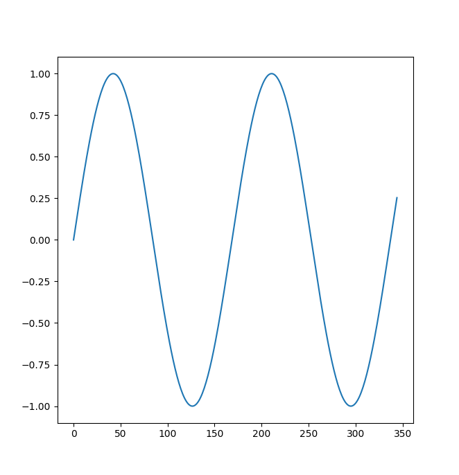
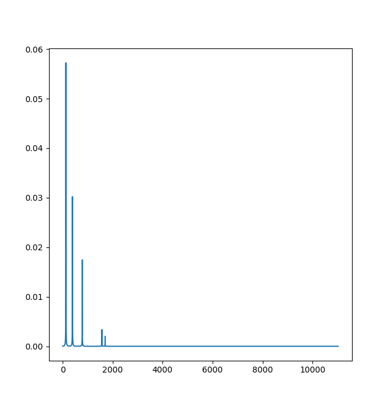

# Standard library documentation
## SMNP native library
### `Float(integer number)`
### `Float(string number)`
### `Float(float number)`
Constructor-like function that produces a `float` type from either
integer, string or even float types.
###### Arguments
* `number` - integer/string/float representation of float type
###### Output
* input argument converted to `float` type
##### Example
```
a = 14;
b = "3.14";
A = Float(a);
B = Float(b);

println(A == 14.0);  # true
println(B == 3.14);  # true
```

***
### `Integer(float number)`
### `Integer(string number)`
### `Integer(integer number)`
Constructor-like function that produces a `integer` type from
either float, string or even integer types.

**Note:** float-to-integer conversion is always done
with floor rounding first (see example).
###### Arguments
* `number` - float/string/integer representation of integer type
###### Output
* input argument converted to `integer` type
##### Example
```
a = 3.14;
b = 3.74;
c = "14";

A = Integer(a);
B = Integer(B);
C = Integer(C);

println(A == 3);     # true
println(B == 3);     # true
println(C == 14);    # true
```

***
### `Map(keyValuePairs...)`
### `Map(list keyValuePairs)`
Constructor-like function that produces a `map` type using passed
lists, that first element is a key and the second one is a value.
The second element can be anything, whereas the first one
can be only of types: `integer`, `string`, `bool`, `note` and `type`.
Both versions of the function works similar. The only difference is
that the first version accepts two-element lists as vararg, whereas
the second one accepts a single list of mentioned two-element lists (see example).
###### Arguments
* `keyValuePairs` - list/vararg of two-element lists that represents key-value pairs.
The first element of the list is key related to second element of it which acts as value.
###### Output
* a `map` composed from given lists
##### Example
```
x = Map(["c", @c], ["d", @d], ["e", @e]);
y = Map([["c", @c], ["d", @d], ["e", @e]]);
z = { c -> @c, d -> @d, e -> @e };

println(x == y and y == z);  # true
```

***
### `Note(string pitch, integer octave, integer duration, bool dot)`
Constructor-like function that produces a `note` type
with given parameters.
###### Arguments
* `pitch` - a pitch of note (case insensitive)
* `octave` - a octave of note
* `duration` - a duration of note
* `dot` - produced note is dotted if true
###### Output
* a `note` with given parameters
##### Example
```
x = Note("C#", 3, 2, true);

println(x == @c#3:2d);      # true
```

***
### `Sound(string path)`
Constructor-like function that produces a `sound` object
associated with a sound file of given path.
Note, that this is the only way to obtain a `sound` object.
###### Arguments
* `path` - a relative or absolute path to music file
###### Output
* a `sound` value with sound of given path

***
### `wait()`
### `wait(integer soundLevel, integer silenceLevel)`
Hangs program execution and waits for sound.
If sound sounds it will wait for its stop.
Only then function will resume program execution.

Read *README/Audio module/Listening module* to learn more about that function.

###### Arguments
* `soundLevel` - a value that must be exceeded for the function to
recognize microphone input as a sound; default value: `300`
* `silenceLevel` - a value that must be lower than input level for the
function to recognize its as a end of sound; default value: `10`
##### Example
```
availableNotes = noteRange(@c, @c5);

# Perform the training scenario 10 times
10 ^ {
    # Get random notes from 'availableNotes' list
    x = sample(availableNotes);
    y = sample(availableNotes);

    # Print and synthesize them
    println(x, " -> ", y);
    synth(x, y);

    # Wait for user to sing them
    wait(50, 150);

    # Give another 2 sec for user 
    # to get ready for next turn
    sleep(2);
}
```

***
### `wave(<integer, note> notes...)`
### `wave(list<integer, note> notes...)`
### `wave(map<string><> config, <integer, note> notes...)`
### `wave(map<string><> config, list<integer, note> notes...)`
Compiles a given notes to wave, which is represented by list of floats.
You can pass additional `config` object which is a map overriding
default configuration parameters.

Read *README/Audio module/Synthesising module* to learn more
about that function.

###### Arguments
* `notes` - vararg/list of notes and integers which is going to be
compiled to wave
* `config` (optional) - a map whose parameters override default function
parameters
###### Output
* `list<float> wave` - a list of floats that represents already compiled
wave that can be synthesised or plotted
##### Example
```
notes = [@c, @c, @g, @g, @a, @a, @g:2, @f, @f, @e, @e, @d, @d, @c:2];
music = wave({ bpm -> 170, overtones -> [0.7, 0.0, 0.0, 0.2, 0.0, 0.0, 0.1] }, notes);
synth(music);
```

***
### `synth(list<float> waves...)`
Synthesises and plays waves (one after another) already compiled by `wave` function.
###### Arguments
* `waves` - lists of floats that represent a wave capable to be synthesised

##### Example
```
wv = wave(noteRange(@c, @c5, "diatonic"));
synth(wv);
```

### `synth(<integer, note> notes...)`
### `synth(list<integer, note> notes...)`
### `synth(map<string><> config, <integer, note> notes...)`
### `synth(map<string><> config, list<integer, note> notes...)`
Works in the same way as `wave` function. The only difference is that
the `wave` function produces a compiled wave as list of floats, whereas
the `synth` function immediately synthesises and plays wave without
returning anything.
###### Arguments
* `notes` - vararg/list of notes and integers which is going to be
compiled to wave
* `config` (optional) - a map whose parameters override default function
parameters

##### Example
```
notes = [@c:8, @h3:8, @c:8, @d:8, @e:8, @d:8, @e:8, @f:8, @g, @a, @g, 4];
2 ^ synth({ bpm -> 170, decay -> 3, overtones -> [0.5, 0.0, 0.3, 0.0, 0.15, 0.0, 0.05] }, notes); 
```

***
### `pause(integer value)` **deprecated** 
Hangs a program execution for a time corresponding 
to duration of note with given value. 
The function also takes a `bpm` variable from the context.
###### Arguments
* `value` a value of corresponding note duration

##### Example
```
bpm = 60    # 60 beats per min = 1 beat per sec
pause(4)    # the same as sleep(1)
pause(2)    # the same as sleep(2)
pause(1)    # the same as sleep(4)

bpm = 120   # 120 beats per min = 2 beats per sec
pause(2)    # the same as sleep(1)
pause(1)    # the same as sleep(2) 
```

##### Deprecation note
In the very first version of SMNP the `bpm` value wasn't passed
directly to `synth` or `wave` method, instead it was set
as regular variable assignment in the code. That's why 
the `pause` function looks for `bpm` variable in the context.

Current version of `pause` function can be implemented as follows:
```
function newPause(integer value, integer bpm = 120) {
    synth({ bpm -> bpm }, value);
}
```

***
### `plot(list<float> fun)`
Treats passed list of floats as mathematical function of indices
and draws its 2D plot (it uses *Matplotlib* plotting framework).
It is really useful to plot compiled waves (see example).
###### Arguments
* `fun` - list of floats to be drawn

##### Example
```
cNote = @c:256;
cNoteWave = wave({ attack -> 0, decay -> 0, overtones -> [1.0] }, c);
plot(cNoteWave);
```


***
### `fft(list<float> fun)`
Transposes input list of floats being treated as function to another
list of floats using fast algorithm computing discrete Fourier transform (provided by *Numpy* framework).
It can be useful to plot wave spectrum or overtones of note sound.
###### Arguments
* `fun` list of floats which is going to be processed with FFT algorithm
###### Output
* a list of floats being a result of transforming input list with FFT
algorithm

##### Example
```
# The sound consists of 5 overtones: 1st, 3rd, 6th, 12th and 13th:
overtones = [0.5, 0.0, 0.3, 0.0, 0.0, 0.15] + (5 ^ 0.0) + [0.03, 0.02];
signal = wave({ overtones -> overtones }, @c);
spectrum = fft(signal);
plot(spectrum); 
```


***
### `rand(integer min, integer max)`
Returns a random `integer` from range *min—max* inclusive.
###### Arguments
* `min` - lower range limit (also included to the range)
* `max` - upper range limit (also included to the range)
###### Output
* a number of `integer` type randomly picked from given range

Example:
```
println(5 ^ rand(0, 3));
# Output:
# 1
# 0
# 1
# 3
# 2
```

***
### `print(values...)`
Prints a string representation of each passed object to standard output.
The function implicitly invokes `toString()` method of each passed object,
concatenates it and prints to standard output.
###### Arguments
* `values` - arbitrary objects, whose string representations are about 
to be printed

##### Example
```
print(1, 2, 3, "hello");
print(" world!");
# Output: 123hello world!
```

***
### `println(values...)`
Works at the same way as `print` function, but appends 
a new line character at the end.
###### Arguments
* `values` - arbitrary objects, whose string representations are about 
to be printed

##### Example
```
println(1, 2, 3, "hello");
println(" world!");
# Output: 
# 123hello
#  world!
```

***
### `read()`
### `read(string prompt)`
### `read(type expectedType)`
### `read(string prompt, type expectedType`
Reads user provided input from standard input and returns it.
It can also display given prompt message and convert input 
to expected type. 

###### Arguments
* `prompt` - a message instructing user to provide data
* `expectedType` - a type to which data should be converted.
In case of conversion troubles an error is raised.
**Note**: only `integer`, `bool`, `note` and string of course are
supported so far.

###### Output
* user's input as `string` if `expectedType` is not provided, otherwise
user's input as desired type (just if it is supported)

##### Example
```
$ echo "14" | smnp -c "println(typeOf(read(integer)))"
integer
```

***
### `typeOf(object)`
Returns a object's type.

###### Arguments
* `object` - arbitrary object which type is to be checked
###### Output
* a type of provided object, as `type` value

##### Example
```
println(typeOf(14));                        # integer
println(typeOf(@A#));                       # note
println(typeOf([1, 2, 3]));                 # list
println(typeOf([@c, @d, 4]));               # list
println(typeOf({ c -> @c, d -> @d }));      # map
```

***
### `sleep(integer value)`
Hangs program execution for given time (in seconds).

###### Arguments
* `value` number of seconds of program execution hang

##### Example
```
println("Hello");
sleep(4);
println("World!");  
# Output:
# Hello
# World!            (after 4s)
```

***
### `exit(integer code)`
Immediately interrupts program execution and returns provided
given code to operating system.

###### Arguments
* `code` - an exit code. If function `exit` is never called, SMNP returns
a `0` value as default.

##### Example
```
$ smnp -c "exit(38);"
$ echo $?
38
```

***
### `debug(string parameter)`
Allows to get some information about environment at different 
program execution stages.
###### Arguments
* `parameter` - name of parameter which is to be displayed.
Available values:
    * `environment` - prints whole environment object
    * `variables` - prints only variables with their scopes
    * `functions` - prints declared functions including those coming from *stdlib*
    * `methods` - prints declared methods including those coming from *stdlib*
    * `callstack` - prints a call stack
    
##### Example
```
debug("variables");
x = 1;
debug("variables");

# Output:
# Scopes:
#   [0]: {}
# Scopes:
#   [0]: {'x': INTEGER(1)}
```
    
***
### `<list>.get(integer index)`   
Returns list element of given index.
###### Arguments
* `index` - index of desired element. **Note**, that counting starts from **0**.
###### Output
* element of list with given index. Throws an error if index is out of bounds.

##### Example
```
myList = [1, 2, 3, 4];
lastElement = myList.get(3);
println(lastElement);           # 4
```

***
### `<map>.get(<integer, note, string, bool, type> key)`
Returns map element associated with given key.
###### Arguments
* `key` - key of value that is about to be returned
###### Output
* element associated with given key. Throws an error if key doesn't exist.

##### Example
```
myMap = {
    true -> false,
    integer -> 14,    
    hello -> "world"
};

element = myMap.get("hello");
println(element);               # world

```

***
### `<sound>.play()`
Plays a music file loaded into `sound` type.

##### Example
```
music = Sound("music/buxtehude_passacaglia.ogg");
music.play();
```

***
### `<any>.toString()`
Returns a `string` representation of any available object.

##### Example
```
println(typeOf(14.toString()));                                     # string
println(typeOf("hello, world".toString()));                         # string
println(typeOf(true.toString()));                                   # string
println(typeOf(@Gb3:16d.toString()));                               # string
println(typeOf({ first -> @c, second -> [1, 2, 3] }.toString()));   # string
println(typeOf(void.toString()));                                   # string
```

## SMNP language library
All *SMNP language library* is defined in single file: `smnp/library/code/main.mus`.
Note that some of functions start with underscore (`_`). Even though
SMNP language doesn't have access modifiers known from other languages (like
Java's `private`, `public` etc.), you shouldn't use these method and they aren't
covered in this documentation.

### `flat(list lists...)`
Converts nested lists to single one. You can think, that the function
removes nested square brackets and leaves the outer ones (see examples).
###### Arguments
* `lists` - nested lists supposed to be flat and concatenated
###### Output
* a single list composed of given lists that have been flatten

##### Example
```
list1 = [1, 2, [3]];
list2 = [4, 5, [6, [7]]];
list3 = [[8, 9], [10], [[11, 12], 13], 14];

a = flat(list1, list2, list3);
b = [1, 2, 3, 4, 5, 6, 7, 8, 9, 10, 11, 12, 13, 14]

c = flat([@c, [@d, @e], [@f, [@g, @a], @h, @c5, [@d5]]]);
d = [@c, @d, @e, @f, @g, @a, @h, @c5, @d5];

overtones = flat([0.5, 10^0.0, 0.3, 5^0.0, 0.1, 3^0.0, 0.1]);

println(a == b);    
println(c == d);     
println(overtones);

# Output:
# true
# true
# [0.5, 0.0, 0.0, 0.0, 0.0, 0.0, 0.0, 0.0, 0.0, 0.0, 0.0, 0.3, 0.0, 0.0, 0.0, 0.0, 0.0, 0.1, 0.0, 0.0, 0.0, 0.1]
```

***
### `mod(integer a, integer b)`
Computes and returns reminder after division of `a` by `b`.
###### Arguments
* `a` - the first operand of *modulo* operation
* `b` - the first operand of *modulo* operation
###### Output
* `a mod b` value computed as `a - b * floor(a/b)`

##### Example
```
12 as i ^ println(i, " mod ", 3, " = ", mod(i, 3));
# Output:
# 0 mod 3 = 0
# 1 mod 3 = 1
# 2 mod 3 = 2
# 3 mod 3 = 0
# 4 mod 3 = 1
# 5 mod 3 = 2
# 6 mod 3 = 0
# 7 mod 3 = 1
# 8 mod 3 = 2
# 9 mod 3 = 0
# 10 mod 3 = 1
# 11 mod 3 = 2
```

***
### `sample(items...)`
### `sample(list items)`
Returns randomly picked item from provided arguments or list of items.
###### Arguments
* `items` - list of items from which one of them is to be randomly picked
###### Output
* one, randomly picked element of provided list

##### Example
```
5 ^ println(sample(noteRange(@c, @f)));
# Output:
# CIS
# F
# C
# D
# C

println(sample(1, 2, 3, 4, 5));     # 4
```

***
### `random(map<string><> items...)`
Returns randomly picked value from given items according 
to provided probability and using uniform distribution.
Function randomly picks a one of provided maps and returns
a value that is assigned to `value` key of picked map.
###### Arguments
* `items` - a maps consisted of two key-value pairs:
    * arbitrary value assigned to `value` key which is
        an object to be returned 
    * `integer` value assigned to `percent` key which 
        is a percent value of probability of picking
        the map. Sum of each map's `percent` value must be
        equal to 100.
        
###### Output
* an object assigned to `value` of randomly picked map provided as argument

##### Example
```
10 ^ {
    x = random(
        { percent -> 75, value -> "hello" },
        { percent -> 20, value -> "world" },
        { percent -> 5, value -> "hey" }
    );

    println(x);
}

# Output:
# hello
# world
# hey
# hello
# hello
# hello
# hello
# world
# hello
# hello
```        

***
### `range(<integer, float> a, <integer, float> b, <integer, float> step = 1)`
Returns a list containing all values with given step from range *a—b* inclusive.

###### Arguments
* `a` - lower range limit (also included to the range)
* `b` - upper range limit (also included to the range)
* `step` (optional) - difference between each pair of adjacent elements

###### Output
* list of integers or float numbers (depending on type of provided arguments)

##### Example
```
println(range(1, 5) == [1, 2, 3, 4, 5]);                # true
println(range(1, 10, 2) == [1, 3, 5, 7, 9]);            # true
println(range(5, 30, 5) == [5, 10, 15, 20, 25, 30]);    # true

# Using minus operator ('-') you are able to reverse lists:
println(-range(2, 12, 2) == [12, 10, 8, 6, 4, 2]);      # true
```

***
### `noteRange(note a, note b, string filter = "all")`
Returns a list containing all notes from range *a—b* inclusive which meets 
provided filter.
###### Arguments
* `a` - lower range limit (also included to the range)
* `b` - upper range limit (also included to the range)
* `filter` (optional) - allows to select what kind of notes should be
included to the list.
Available filters: 
    * `all` - returns all notes from given range
    * `diatonic` - returns only diatonic notes (C, D, E, F, G, A and H) from given range
    * `chromatic` - returns only chromatic notes (C#/Db, D#/Eb, F#/Gb, G#/Ab, A#/B) from given range   
###### Output
* a list of notes from given range with provided filter applied

##### Example
```
println(noteRange(@g3, @g) == [@g3, @g#3, @a3, @b3, @h3, @c, @c#, @d, @d#, @e, @f, @f#, @g]);   # true
println(noteRange(@c, @c5, "diatonic") == [@c, @d, @e, @f, @g, @a, @h, @c5]);                   # true
println(noteRange(@d5, @a5, "chromatic") == [@d#5, @f#5, @g#5]);                                # true
```    

***
### `transpose(integer value, <note, integer> notes...)`
### `transpose(integer value, list<note, integer> notes)`
Transposes provided notes by given value which is a number of semitones.
Note, that integers acting as rests are ignored.
###### Arguments
* `value` - a number of semitones. If the value is positive, notes will be up-transposed,
otherwise it'll be down-transposed.
* `notes` - a list of notes and integers. All notes of the list will be transposed
by given number of semitones.
###### Output
* list of transposed notes with integers remaining at their original places

##### Example
```
cMajor = [@c, @d, @e, @e, @f, @f, @e:2, 2];
dMajor = transpose(2, cMajor);
gMajor = transpose(-7, dMajor);

println(dMajor == [@d, @e, @f#, @f#, @g, @g, @f#:2, 2]);
println(gMajor == [@g3, @a3, @h3, @h3, @c, @c, @h3:2, 2]); 
```

***
### `transposeTo(note target, <note, integer> notes...)`
### `transposeTo(note target, list<note, integer> notes)`
Transposes provided notes to given target, so that the first of transposed
notes will be equal to `target`. Integers acting as rests are ignored.
###### Arguments
* `target` - determines a pitch and octave of first of transposed notes
* `notes` - a list of notes and integers supposed to be transposed
###### Output
* list of transposed notes with integers remaining at their original places

##### Example
```
cMajorScale = noteRange(@c, @c5, "diatonic");
aMajorScale = transposeTo(@a, cMajorScale);
d5MajorScale = transposeTo(@d5, aMajorScale);

println(aMajorScale == [@a, @h, @c#5, @d5, @e5, @f#5, @g#5, @a5]);      # true
println(d5MajorScale == [@d5, @e5, @f#5, @g5, @a5, @h5, @c#6, @d6]);    # true
```

***
### `semitones(<note, integer> notes...)`
### `semitones(list<note, integer> notes)`
Returns a list of numbers of semitones between provided notes.
###### Arguments
* `notes` a list of notes and integers acting as music rests. 
The list is filtering to get rid of integers so they are just ignored as they were 
not there.
###### Output
* typically list of integers which represent a number of semitones
between each pair of adjacent notes. 
If you invoke the function with only 2 note arguments, the return value will be
just an integer not wrapped in any lists (see examples).

##### Example
```
a = semitones(@c, @g);
b = semitones(@c, @d, @e, @f);
c = semitones([@c, @g]);
d = semitones([@c, @d, @e, @f]);
e = semitones([@c, 2, 4, @g]);
f = semitones([@c, @d, @e, @f], [@g, @a, @h, @c5]);

println(a); # 7
println(b); # [2, 2, 1]
println(c); # [7]
println(d); # [[2, 2, 1]]
println(e); # [7]
println(f); # [[2, 2, 1], [2, 2, 1]]
```

***
### `stringInterval(integer semitones)`
Returns a pretty interval name as string for given number of semitones.
Works only for pitch values, so the max accepted value of `semitones` is 11.
###### Arguments
* `semitones` - a number of semitones to be converted to string
###### Output
* interval name for given semitones number

##### Example
```
12 as i ^ println(stringInterval(i));
# Output:
# 1
# 2m
# 2M
# 3m
# 3M
# 4
# 5d/4A
# 5
# 6m
# 6M
# 7m
# 7M
```

***
### `interval(<note, integer> notes...)`
### `interval(list<note, integer> notes)`
Composes mentioned `semitones` and `stringInterval` functions together.
Works at the same way as `semitones` function. The difference is that
produces list of strings (containing a pretty name of intervals) 
instead of list of numbers (acting as numbers of semitones).
###### Arguments
* `notes` a list of notes and integers acting as music rests (see `semitones` function documentation)
###### Output
* typically list of strings which represents a pretty name of intervals 
(see also `semitones` function documentation)

##### Example
```
a = interval(@c, @g);
b = interval(@c, @d, @e, @f);
c = interval([@c, @g]);
d = interval([@c, @d, @e, @f]);
e = interval([@c, 2, 4, @g]);
f = interval([@c, @d, @e, @f], [@g, @a, @h, @c5]);

println(a); # 5
println(b); # [2M, 2M, 2m]
println(c); # [5]
println(d); # [[2M, 2M, 2m]]
println(e); # [5]
println(f); # [[2M, 2M, 2m], [2M, 2M, 2m]]
```

***
### `tuplet(integer n, integer m, note notes...)`
Returns given tuplet of provided notes as list.
###### Arguments
* `n` - how many notes does tuplet contain:
    * `n = 3` for triplet
    * `n = 5` for quintuplet
    * etc.
* `m` - how many notes is replaced by tuplet:
    * `m = 2` for triplet
    * `m = 4` for quintuplet
    * etc.
* `notes` - notes supposed to be included in tuplet. **Note**, that
the number of notes must be equal to `n` argument.
###### Output
* created tuplet as list of notes

##### Example
```
triplet = tuplet(3, 2, @c, @d, @e);
quintuplet = tuplet(5, 4, @c, @d, @e, @f, @g);

synth(triplet);
synth(quintuplet);
```    

***
### `metronome(integer bpm = 120, integer beats = 4, countMeasures = false)`
Starts a metronome with synthesised beats and accents.

###### Arguments
* `bpm` (optional) - determines metronome's tempo
* `beats` (optional) - determines a time signature per quarters:
    * `4` = 4/4
    * `3` = 3/4
    * `2` = 2/4
    * etc.
* `countMeasures` (optional) - prints a number of measure for each cycle

##### Example
```
$ smnp -c "metronome(120, 4, true)"
1
2
3
4
```

***
### `alert(<integer, bool> cycles = true, string melody = "beep", list<float, integer> overtones = [0.5, 0.0, 0.0, 0.5])`
Synthesises an alert melody.
###### Arguments
* `cycles` - number of alert cycles. Infinite if `true`.
* `melody` - a name of synthesised melody. Available values:
    * `beep`
    * `s1`
    * `s2`
    * `s3`
    * `semitones`
* `overtones` - allows to compose custom sound of alert

##### Example
```
$ ./some_exhausting_task && echo "Done!" && smnp -c "alert()"
/after a long time/
Done!
```

***
### `noteFromIntRepr(integer intRepr, integer duration, bool dot)`
Creates a `note` with given duration (including or not the dot) basing on
passed *intRepr* value.
The *intRepr* is a number representation of note's octave and pitch.
It is computed using following algorithm:
1. let's renumber available pitches:
    * C ⇒ 0
    * C# ⇒ 1
    * D ⇒ 2
    * D# ⇒ 3
    * E ⇒ 4
    * F ⇒ 5
    * F# ⇒ 6
    * G ⇒ 7
    * G# ⇒ 8
    * A ⇒ 9
    * A# ⇒ 10
    * H ⇒ 11
2. convert a note's pitch value using mappings above
3. multiple note's octave by 12 and add it to the result of the second point

For example:
```
# For @f#5 note:
# 1. f# => 6
# 2. 5th octave => 5 * 12 = 60
# 3. 60 + 6 = 66
#    66 is the intRepr of @f#5 note   
```

**Note**, that the *intRepr* depends only on pitch and octave.
Note duration doesn't have any effect on the *intRepr* value.
That's why the function accepts also duration-related arguments.
###### Arguments
* `intRepr` - a `integer` determining a pitch and octave of new note
* `duration` - a duration of new note
* `dot` - true if note should be dotted
###### Output
* note created from given arguments

##### Example
```
x = noteFromIntRepr(66, 8, true);
println(x == @f#5:8d);      # true
``` 

***
### `<note>.toIntRepr()`
Returns a *intRepr* of note.
###### Output
* an *intRepr* as `integer`

##### Example
```
x = @f#5.toIntRepr();
println(x);         # 66
```

***
### `<note>.transpose(integer value)`
Copies note and transposes it by given semitones.
###### Arguments
* `value` - a number of semitones
###### Output
* new transposed note with copied duration-related attributes

##### Example
```
x = @Fb;
y = x.transpose(2);

println(x == @Fb);          # true
println(y == @Gb);          # true
```

***
### `<note>.withOctave(integer octave)`
Copies note and returns it with new value of `octave` parameter.
###### Arguments
* `octave` - desired octave
###### Output
* copy of note with changed value of `octave` parameter

##### Example
```
x = @F5:8d;
y = x.withOctave(6);

println(x == @F5:8d);       # true
println(y == @F6:8d);       # true
```

***
### `<note>.withDuration(integer duration)`
Copies note and returns it with new value of `duration` parameter.
###### Arguments
* `duration` - desired duration
###### Output
* copy of note with changed value of `duration` parameter

##### Example
```
x = @F5:8d;
y = x.withDuration(2);

println(x == @F5:8d);       # true
println(y == @F5:2d);       # true
```


***
### `<note>.withDot(bool dot)`
Copies note and returns it with new value of `dot` parameter.
###### Arguments
* `dot` - determines if new note is supposed to be dotted
###### Output
* copy of note with changed value of `dot` parameter

##### Example
```
x = @F5:8d;
y = x.withDot(false);

println(x == @F5:8d);       # true
println(y == @F5:8);        # true
```

***
### `<list>.contains(expectedValue)`
Checks if list does contain given value.
###### Arguments
* `expectedValue` - a searched element
###### Output
* `true` if provided value is contained in list, `false` otherwise

##### Example
```
myList = [1, 2, @c, true, bool, "hello"];
println(myList.contains("hello"));      # true
println(myList.contains(integer));      # false
```

***
### `<map>.containsKey(expectedKey)`
Checks if map does containing a key-value pair with given key.
###### Arguments
* `expectedKey` - a searched key
* `true` if map does contain a key-value pair with given key, `false` otherwise

##### Example
```
myMap = {
    hello -> 14,
    world -> @Db:16,
    true -> false,
    integer -> [3.14]
};

println(myMap.containsKey("hello"));    # true
println(myMap.containsKey(false));      # false

```


***
### `<map>.containsValue(expectedValue)`
Checks if map does containing a key-value pair with given value.
###### Arguments
* `expectedValue` - a searched value
* `true` if map does contain a key-value pair with given value, `false` otherwise

##### Example
```
myMap = {
    hello -> 14,
    world -> @Db:16,
    true -> false,
    integer -> [3.14]
};

println(myMap.containsValue([3.14]));   # true
println(myMap.containsValue({}));       # false
```


***
### `<map>.contains(key, value)`
Checks if map does containing given key-value pair.
###### Arguments
* `key` - a key of searched key-value pair
* `value` - a value of searched key-value pair
* `true` if map does contain given key-value pair, `false` otherwise

##### Example
```
myMap = {
    hello -> 14,
    world -> @Db:16,
    true -> false,
    integer -> [3.14]
};

println(myMap.contains(integer, [3.14]));   # true
println(myMap.contains(integer, 3.14));     # false
println(myMap.contains(type, [3.14]));      # false
```

***
### `<string>.join(list<string> l)`
Treats the string as delimiter and uses it to concatenate each 
element of passed list of strings.
###### Arguments
* `l` - list of strings to be concatenated
###### Output
* a single, concatenated string

##### Example
```
myList = [@c, @d, @e, @f];
output = " :: ".join(myList as e ^ e.toString());
println(output);     # C :: D :: E :: F
```

